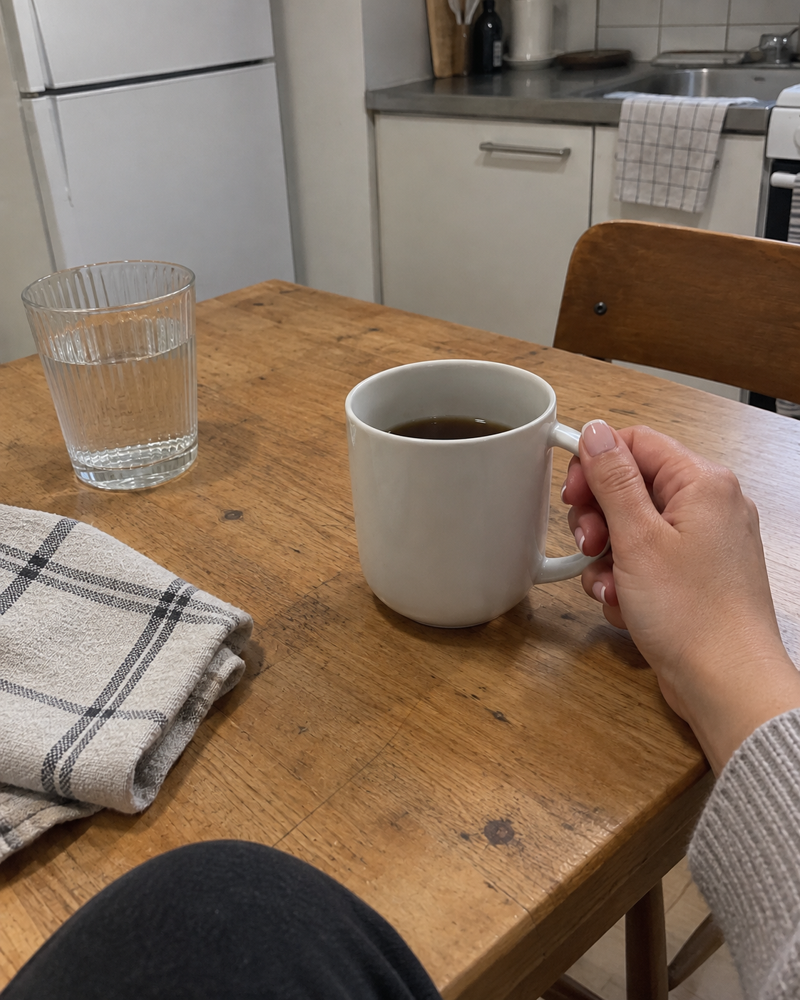
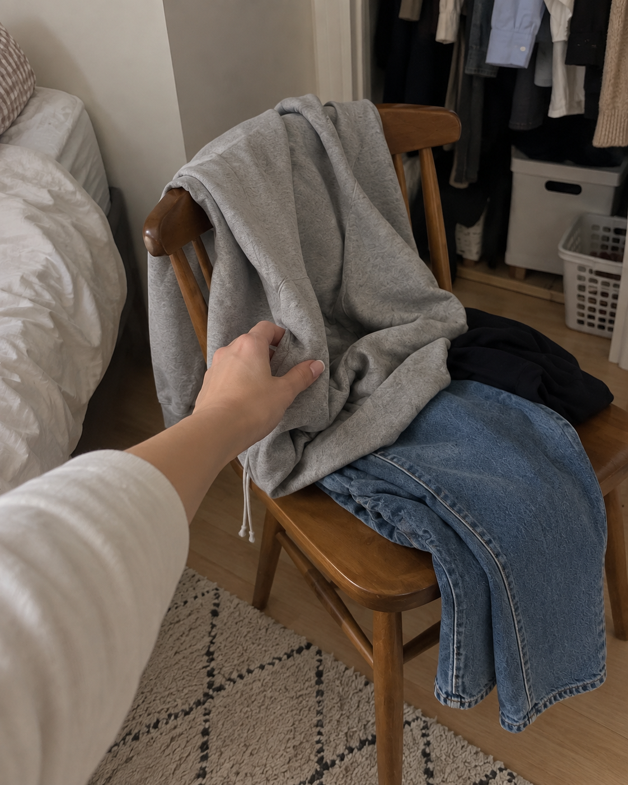
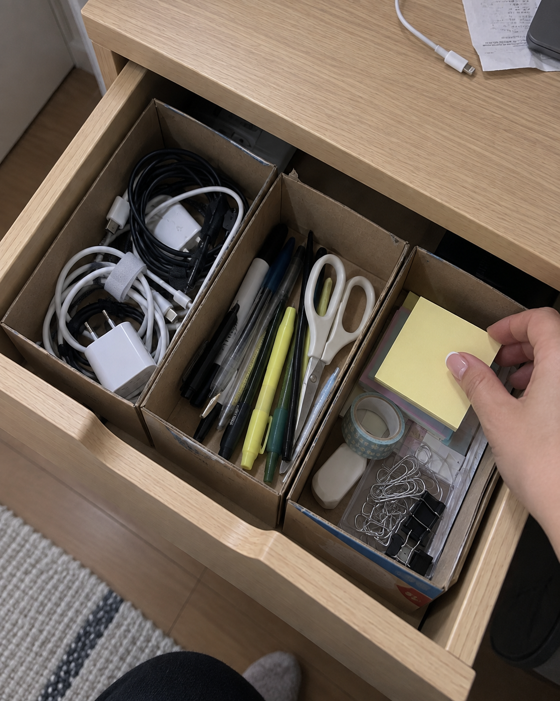
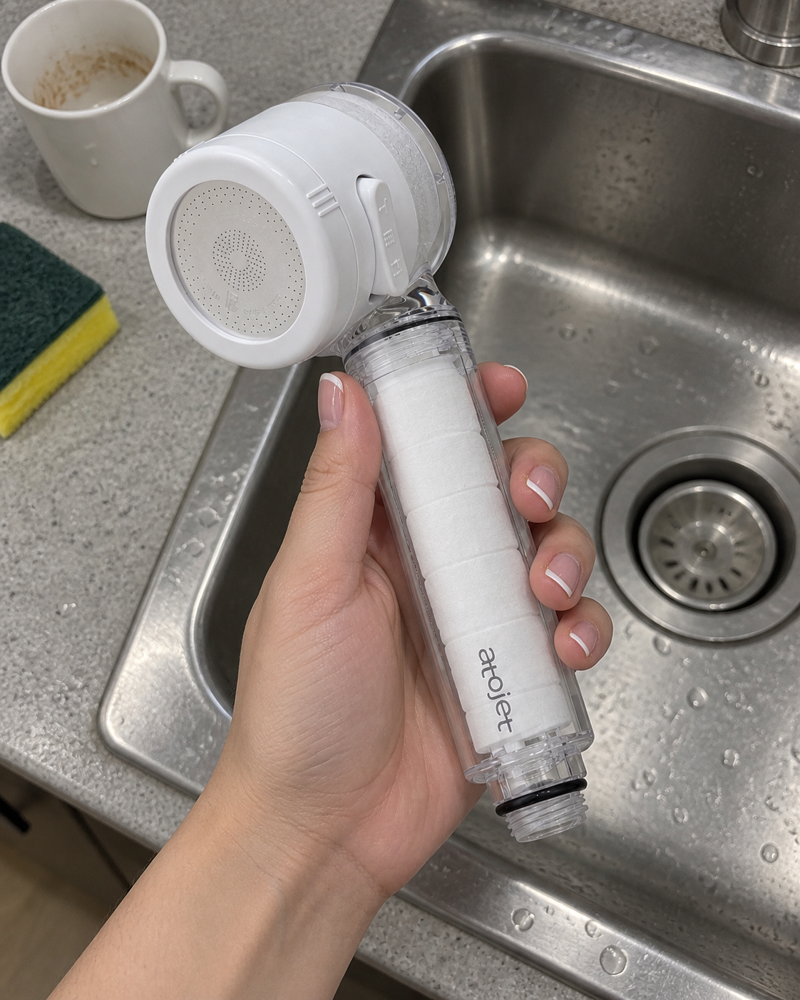

# 첫 5개 게시물 구성

기존 스팀다리미 글 1개 게시 완료. 아래 4개는 한국시간 기준 예약이며 GitHub 실행 지연이 있을 수 있습니다.

## 2026-09-16T08:30:00+09:00

여긴 대놓고 쿠팡파트너스 하는 계정이야.
근데 장바구니까지 따라가서 등 떠밀진 않을게 ㅋㅋ

“이걸 왜 사?”에 답이 있는 물건,
안 사도 써먹는 생활 팁,
그냥 웃겨서 보여주고 싶은 것도 올릴 거야.

직접 써본 것과 찾아본 건 구분하고
아쉬운 점도 같이 적을게.

살림에서 제일 귀찮은 일 하나만 꼽으면 뭐야?

사진은 AI 연출 이미지.

## 2026-09-16T12:30:00+09:00

의자 샀는데
옷이 더 오래 앉아 있음 ㅋㅋ

빨기엔 애매하고
옷장에 넣기엔 찝찝한
“한 번 입은 옷” 전용 좌석.

너희 집도 의자 하나쯤은
본업 잃고 일하는 중이야?

사진은 AI 연출 이미지.

## 2026-09-16T20:30:00+09:00

정리하려고 수납함 샀는데
그 수납함 둘 자리가 없는 상황 ㅋㅋ

새로 사기 전에 이렇게 해보자.
서랍 한 칸만 비우고 → 버릴 것 빼고 → 남은 걸 종류별로.

집에 있는 작은 빈 상자로 며칠 나눠 써보면
어떤 칸이 필요한지 감이 와.
그다음 서랍 안쪽 치수 재고 골라도 늦지 않지.

오늘은 물건 말고 자리부터 만들자.

사진은 AI 연출 이미지.

## 2026-09-17T08:30:00+09:00

주방 필터 살 때
후기보다 먼저 볼 것: 우리 집에 맞나? ㅋㅋ

오늘 후보는 아토젯 클렌징 주방 핸디형 세트.
헤드필터 3개·바디필터 6개 구성이라 눈에 들어왔어.

장바구니 넣기 전에 수전 연결부랑
상세페이지 호환 안내부터 비교해봐.

사진은 AI 연출 이미지.
이 포스팅은 쿠팡 파트너스 활동의 일환으로, 이에 따른 일정액의 수수료를 제공받습니다.
https://link.coupang.com/a/g4ntewoJ40

## 이미지 제작

내장 imagegen 사용. 네일아트한 손이 등장하는 평범한 집의 실내등·비스듬한 휴대폰 시점. 의자 위 한 번 입은 옷, 빈 상자로 칸을 나눈 서랍, 실제 상품 외형을 참조한 미설치 주방 필터. 모든 사진은 연출 이미지이며 실제 사용 경험으로 표현하지 않았습니다.